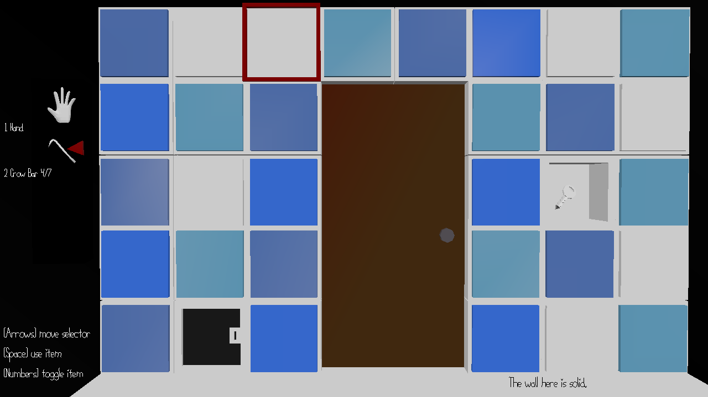

# (TODO: your game's title)

Author: Isa Lie

Design: Cats love smashing glass cups, and now there's a game that turns their mischief into a point-scoring mission. With three cup types, including a speed-boosting potion, players must strategically push cups off surfaces to maximize their score within a time limit.

Screen Shot:

How Your Asset Pipeline Works:

The Asset Pipeline is divided into the exporting and importing portion. 

Exporting (.png -> binary)

An cmake project called AssetPipeline is used to export .png file of tiles into binary files.
see my-game1/AssetPipeline/AssetPipeline/README for more information.

To use the executable for asset exportation
AssetPipeline -f [file1] [file2].. -m [magic1] [magic2].. 
If magic is not provided, first 4 chars of the file name is used. Use of -m still required.

Note that for multiple files to share the same palettes, they need to be entered in the same batch. 
For this specific project, the command used to export the assets is:  AssetPipeline -f cat.png surface.png integers.png moon.png cups.png -m cat txtr nums

The code exports by reading in all .png files with stb image and the read_chunk() helper function, and loops through each .png, and then each 8x8 tile of each .png image.
For each 8x8 tile, the program finds or constructs a suitable palette, and generate the two bits indicating color for each pixel. The program then writes in the file corresponding to the png 2 * 64 + 1 bytes. The first byte corresponds to the palette index, and the remaining 2 * 64 bytes corresponds to bit0 and bit1 of each tile pixel.

Importing (binary -> tiles & palettes)

The importing is done in the constuctor of PlayMode(). 
set_tiles(string file, string magic, int start_tile) Takes a file, and import the corresponding data into ppu.tile_table and ppu.tile_palette_map starting at index start_tile.
Before loading in the file, the code also checks that the magic value of the file matches the magic variable input into the function.
	
set_palette() Does the same thing, with hardcoded magic and file value. Corresponding data are loaded into ppu.palettes.

Once the tiles are loaded, sprites and their initial locations are hardcoded. 
the function set_cat() sets the 7 sprite group with relative positions according to the player position.
the function spawn_cup() and drop_cups() spawns and drops the cup by setting the position of the appropriate sprites.

The pipeline reads and writes to the asset/ folder in the .exe

(TODO: make sure the source files you drew are included. You can [link](your/file.png) to them to be a bit fancier.)

How To Play:

Controls: 
[Left Arrow] Move left
[Right Arrow] Move right
[Space Bar] Push cup

The goal is to get as many points as possible in 30s.
Containers:
Small cup: +1 pt
Tall glass: +2 pt
Potion: Increase Speed

This game was built with [NEST](NEST.md).

