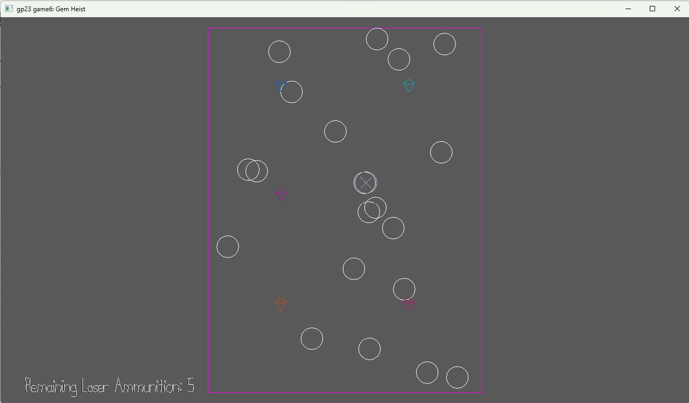

# Safe & Sound

Author: Isa Lie

Design: This game challenges players to knock on wall panels, using auditory clues to find hollow spots and uncover hidden items. With only seven tries, players must carefully solve the puzzle and escape the room before their chances run out.

Screen Shot:

How To Play:

The goal is to escape the room the player is trapped in.

[Numbers] Toggle item

[Arrows] Toggle selected scene object

[Space] Use item

Note: The crow bar can only be used 7 times before it breaks! 

This game was built with [NEST](NEST.md).
